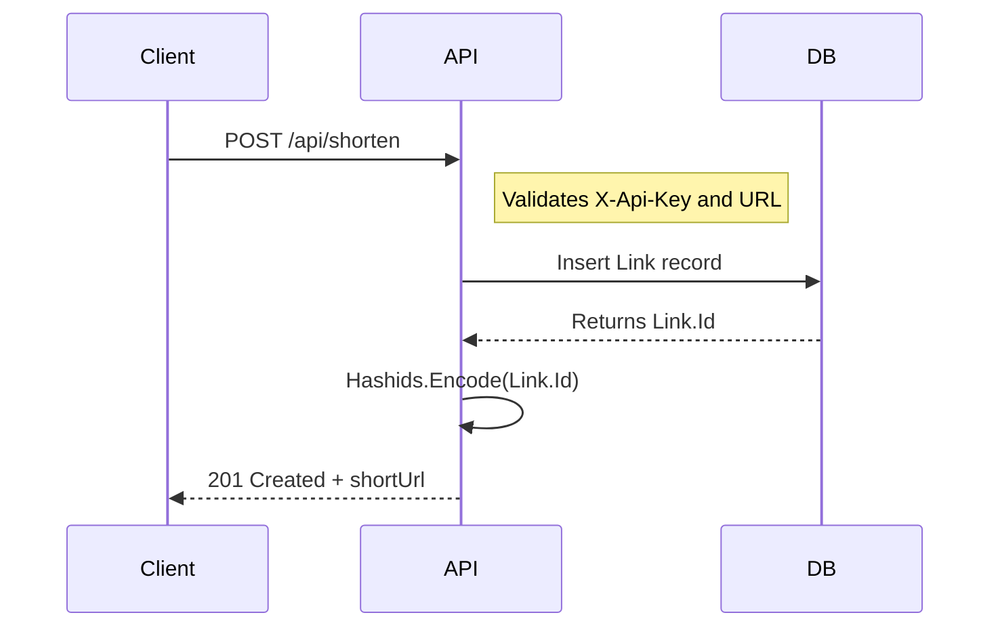
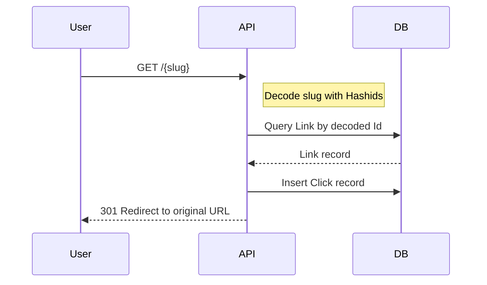

# Minimal API Approach for SmallURL

This file documents the new minimal API architecture, how the slug-based redirect flow works, and how to test the app locally.

## Overview

The app has been refactored from an MVC web application into a minimal API service using ASP.NET Core and SQLite. The new approach is simpler, lighter, and optimized for API-first usage.

Key changes:
- `Program.cs` is now the single entry point for routing, middleware, and service setup.
- The app uses `ApplicationDbContext` with SQLite instead of MySQL.
- App settings are now ignored by Git (`appsettings*.json` added to `.gitignore`).
- New public and protected API endpoints replace the old controller-based UI flow.

## Architecture Diagram

```mermaid
flowchart TD
    Browser[Browser / Client]
    API[Minimal API Service]
    DB[SQLite Database]

    Browser -->|GET /{slug}| API
    Browser -->|GET /api/stats| API
    Browser -->|POST /api/shorten| API
    Browser -->|DELETE /api/links/{slug}| API

    API --> DB
    DB --> API
```

## Request Flow

### 1. Shorten URL



### 2. Redirect from slug



## Data Model

The app now uses two main entities for the minimal API:

- `Link`
  - `Id` (int)
  - `OriginalUrl` (string)
  - `Label` (string)
  - `CustomSlug` (string?)
  - `CreatedAt` (DateTime)
  - `Clicks` (collection)

- `Click`
  - `Id` (int)
  - `LinkId` (int)
  - `ClickedAt` (DateTime)

A third model, `UrlMapping`, remains in the project but is not the primary API model for the new minimal service.

```mermaid
erDiagram
    LINK ||--o{ CLICK : records
    LINK {
      int Id
      string OriginalUrl
      string Label
      string? CustomSlug
      DateTime CreatedAt
    }
    CLICK {
      int Id
      int LinkId
      DateTime ClickedAt
    }
```

## Configuration

The app reads configuration from `appsettings.json` or `appsettings.Development.json` when running locally. Since these files are now ignored by Git, you can safely keep local values without committing secrets.

Minimum required settings:

```json
{
  "ConnectionStrings": {
    "DefaultConnection": "Data Source=smallurl.db"
  },
  "ApiKey": "dev-api-key",
  "Hashids": {
    "Salt": "my salt"
  }
}
```

### Important
- `ApiKey` is required for protected endpoints.
- `Hashids:Salt` is required to encode and decode slugs consistently.
- The app will create `smallurl.db` automatically on startup if it does not exist.

## API Endpoints

### Public

- `GET /`
  - Health check
- `GET /{slug}`
  - Redirects to the original URL
- `GET /api/stats/{slug}`
  - Returns stats for one link
- `GET /api/stats`
  - Returns stats for all links

### Protected (requires `X-Api-Key`)

- `POST /api/shorten`
  - Creates a new short link
  - JSON body: `{ "Url": "https://example.com", "Label": "Example", "CustomSlug": "hello" }`
- `DELETE /api/links/{slug}`
  - Deletes a link by slug

## Local Testing

### 1. Start the app

From the repository root:

```powershell
cd C:\Users\DELL\Desktop\Coded\intisor\smallurl
dotnet run
```

If the app is already running and locking files, stop the process first and rerun.

### 2. Verify the service is live

Open your browser or use curl:

```bash
curl http://localhost:5029/
```

Expected response:

```json
{
  "service": "i.intitech.dev",
  "status": "operational",
  "timestamp": "2026-04-30T...Z"
}
```

### 3. Create a short URL

```bash
curl -X POST http://localhost:5029/api/shorten \
  -H "Content-Type: application/json" \
  -H "X-Api-Key: dev-api-key" \
  -d '{"Url":"https://example.com","Label":"Example"}'
```

### 4. Redirect a slug

Take the `slug` returned by the shorten endpoint and open it in the browser:

```bash
curl -I http://localhost:5029/{slug}
```

You should receive a `301 Moved Permanently` response with a `Location` header pointing to the original URL.

### 5. View stats

```bash
curl http://localhost:5029/api/stats
```

### 6. Delete a short link

```bash
curl -X DELETE http://localhost:5029/api/links/{slug} \
  -H "X-Api-Key: dev-api-key"
```

## Notes

- The new minimal API is intentionally lightweight and API-driven.
- Existing legacy MVC views and controllers are no longer required for the new service flow.
- Local config values are ignored by Git, so add your development settings safely in `appsettings.Development.json`.

## Summary

The refactor turns SmallURL into a modern minimal API service using ASP.NET Core, SQLite, Hashids-based slugs, and a clear separation between public redirect endpoints and protected management APIs. The new documentation file should help developers understand the flow and test the service locally.
