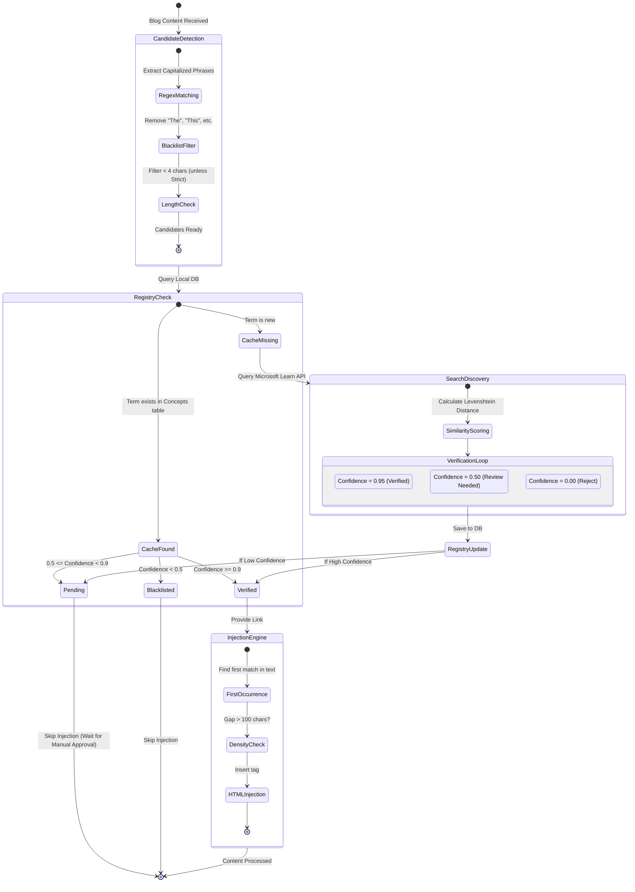

# Intelligent Concept Auto-Linking System

This document outlines the state flow and logic for the automated concept discovery and linking system within SmallURL.

## 1. System State Diagram

## 2. Logic Details

| Logic Component | Implementation | Goal |
| :--- | :--- | :--- |
| **Strict Registry** | Hardcoded list of short terms (C#, .NET, AI). | Prevents common acronym collisions. |
| **Similarity Scoring** | Levenshtein Distance algorithm. | Ensures "Signal" doesn't link to "SignalR". |
| **Density Control** | 100-character gap budget. | Prevents "Link Soup" in dense paragraphs. |
| **Parallel Discovery** | `SemaphoreSlim(5)` + `Task.WhenAll`. | Zero-lag builds for new content. |
| **Human-in-the-Loop** | Manual API endpoints (`/approve`, `/reject`). | Reaches 97%+ perfection over time. |

## 3. Manual Control Endpoints

- **List All**: `GET /api/concepts`
- **Verify**: `POST /api/concepts/{id}/approve`
- **Blacklist**: `POST /api/concepts/{id}/reject`
- **Delete**: `DELETE /api/concepts/{id}`

> [!TIP]
> Use the `X-Api-Key` header for all management requests.
